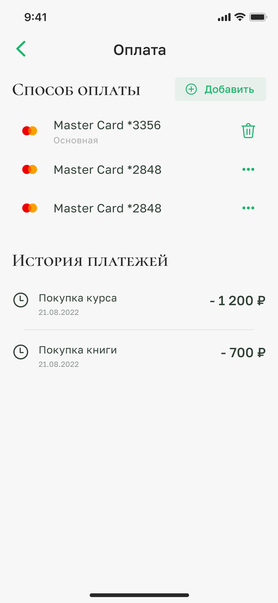
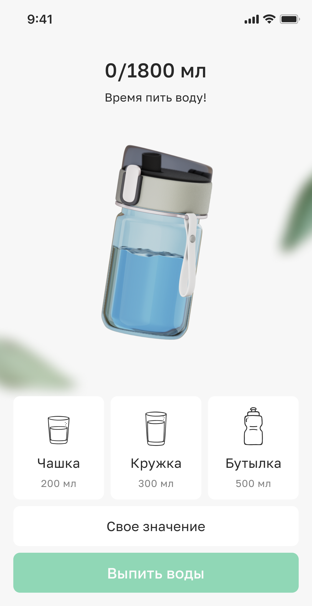
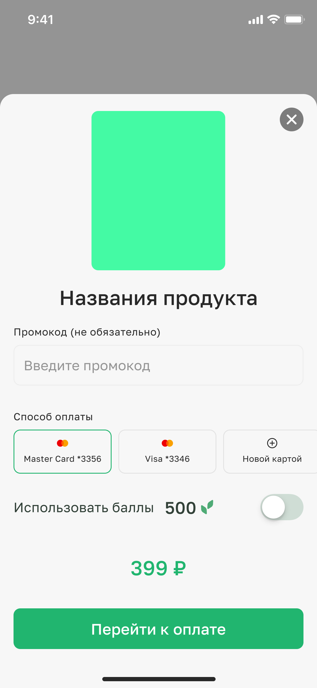

# Пример 1

## Компоненты

- `AnimatedProgress` - обычный linear progress с хуком
- `DatePickerInput` - кастомный календарь с возможностью выбора года из списка
- `IntlPhoneInput` - инпут с поддержкой международных номеров
  ([libphonenumber-js](https://github.com/catamphetamine/libphonenumber-js)), с форматированием номера в зависимости от
  выбранной страны и валидацией.
- `TabSwitch` - обычные табы с дженерик типом
- `View` - кастомный View с короткими описаниями базовых стилей в `props` для упрощение верстки.

## Модули

### `payment`

Модуль оплаты и управление с картой. Поддерживается платежная система cloudpayments и stripe. Включает в себя функционал
получение списка сохраненных карт, добавление и удаление карты, оплата по новой и сохраненной карте, подтверждение 3ds.

Модуль содержит подмодуль `transaction` для получение списка транзакций.

Модуль имеет два экрана: - `PaymentSettingsScreen` - список транзакций, список сохранных карт, добавление и удаление
карты. - `CardFormScreen` - форма добавление или оплата новой картой.

### `water`

Модуль трекинга воды. Включает в себя функционал получение информации о выпитой воде и добавление выпитой воды.

В этом модуле хочу обратить внимание на анимацию воды в бутылке, который должен заполняется по мере выпитой воды.
Анимацию является рендером, то есть растровый, поэтому через lottie не получиться сделать, `gif` тоже не вариант, так
как нужно контролировать прогресс анимации. В итоге решил сделать через видео, можно оптимизировать видео,
контролировать прогресс с play/pause/resume/stop и будет плавность воспроизведение.

Вся анимация содержится в компоненте `WaterBottle`.

https://github.com/hatamsoyunov/code-examples/assets/24550178/795829fc-d30d-4503-b26a-3bfb21b5285f

## Виджеты

### `ProductPurchaseWidget`

Виджет оплаты, универсальный, открывается снизу (Bottom Sheet) принимает превью, название, стоимость, валюту и т.д.
Виджет сам по себе не используется в чистом виде, это только база и не имеет связей с конкретными продуктами. Работает с
модулем `payment`.

### `SubscriptionPurchaseWidget`

Виджет оформление подписки, HOC компонент над виджетом `ProductPurchaseWidget`, с привязкой к модулю подписки, передачей
данных и обработкой событий.

